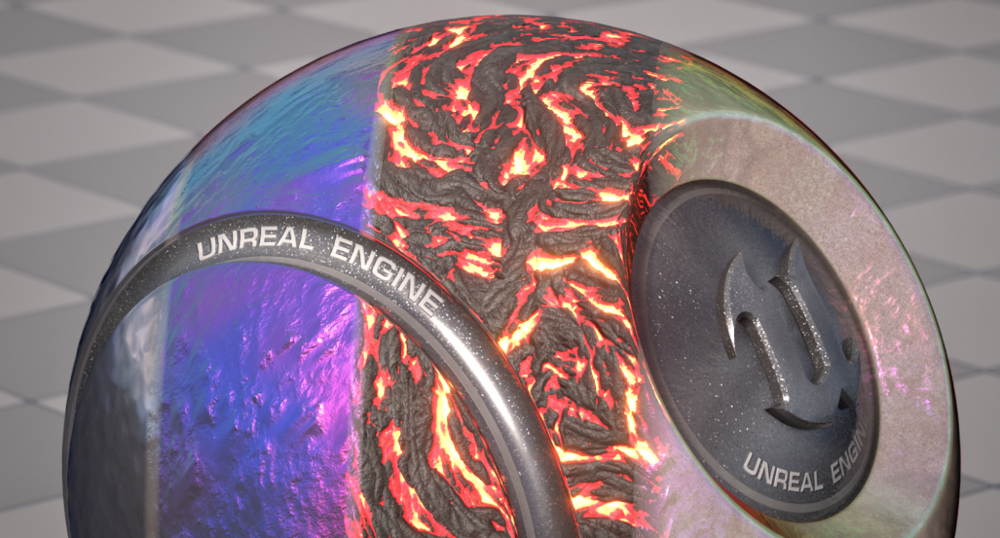
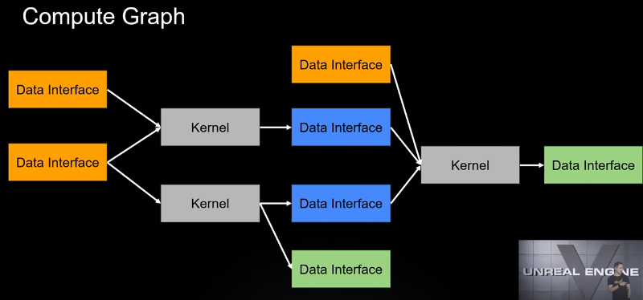

Epic在上周正式推出了[ue5.1](https://docs.unrealengine.com/5.1/en-US/unreal-engine-5.1-release-notes/)，有一些比较重要的特性将在这里做简要介绍，有哪些渲染向更新以及可以用在移动端的特性也将重点介绍。作为一个小的总结，梳理引擎更新的思路和发展的脉络。
<!-- more -->
可以看到官方导览中Lumen，Nanite和vsm仍旧是花费最多的更新部分。WorldPartition也有所改进。虚拟制片等特性就不提了。

#### Lumen
**Lumen**的Two-Sided Foliage相当好看，也就文章开头的图片。stochastic semi-transparent distance field ray trace听着就很高大上，半透明距离场有点意思可以解决过遮挡问题。还有一些关于降噪，反射方面的更新，大家可以按需了解。

#### **Nanite**
现在可以使用双面材质了，高面数的Foliage游刃有余，但仍旧不是一个太成熟的方案，还需要更多的改进和测试，WPO都是beta，那还是再等等吧。
实验性支持了地形，还是比较关键的特性，期待。

#### **TSR**
改进，半透明的问题不知道改进到了何种程度，flickering和moire有所优化，ghost改进，temporal的大坑持续改进中。

**PathTracer**的一大堆优化

#### **GPU Lightmass**
没想到epic还在烘焙上持续更新，也算是给手游和一些基于烘焙的项目的或多或少的支持，可以尝试一下，之前测试是GPU的烘焙效果还是达不到CPU Lightmass。其中一个比较有意思的点是优化了VLM的探针数量，可以下降25%，而且GPU显存也能节省3/4，有点东西。

#### **半透明的覆盖材质**
官方终于实现了2 pass的材质系统，这么简单的需求官方终于做了，看介绍说是用在半透明材质做效果上，其实描边也能用这个材质槽完成。

#### **Strata材质**
为了支持这个材质系统，ue更新了大部分原有shader，可以混合多种shading model渲染，上分层材质我能想到epic的思路是想更统一和简化一种制作规范，在material shader中解决更多问题而不是更繁杂的shader外配置，为物体带来更加丰富的材质表现。试想下面火山材质和single layer water的混合是不是很有意思。clear coat混合更酷炫的车型外观。

#### **Texture and Texture Asset**
加入了R32f和RGBA32F通道位数更多的texture格式。

材质编辑器中的一些Material Expression现在可以直接在编辑器中调节值了，不用点去detail改default value.

#### **Light Mixer**
调节场景整体光源更加方便，在为了诸如动态光照效果去调灯的时候方便一些，可以以此为底盘二次开发符合项目需要的Mixer。

#### **VSM**
的远距离local light渲染，诸如点光 spot light等可以在远处也可以渲染出阴影。，优化了效率。

#### **World Partition**
DataLayer拆成了两个独立的部分，一种是world层面的资源，一种是特定于world的资源，等于给datalayer又加了一层子layer，项目组也可以继续扩展这种layer层级。
Epic提到data layer适合创建相同world的变体，可能也是这种改动的考虑。
WP HLOD layer提供了对Water System的支持。
以及一些actor编辑协作上的更新。
LWC可以支持到88000000千米范围了。

#### Animation
Deformer Framework，Epic为ML Deformer开发了一个新的框架，用ML来为deformer增加更加准确的解算。可以去关注UOD2022的演讲录像，王弥做了很多分享。其中还有一个比较有意思的compute framework，现在ue可以让非programmer更容易上手进行compute shader的编程了，也做了图形化系统叫做Compute Graph，详情也可以去看这次演讲，这里放一个架构图大家感受一下，类似材质编辑器。

Motion Matching集成进ue5，少量动画自动生成更匹配动作的blend pose
其他的动画的同学可以自行去看release note

#### Mobile
最后我们看一下最关注的移动平台更新，
延迟着色正式发布，经过多个版本的迭代终于趋向稳定，支持了一些新的shading model，通过各种魔改gbuffer format完成的，刘伟有分享过。其他特性基本5.0.3也都实现了。
统一了shader compiler为DXR，移动平台shader大增强，微软强大社区引入。
为移动平台新增精度选项，关于移动平台的精度问题，我会再写一篇文章来讲一下。
cluster光源的支持及其反射支持，这块官方一比带过其实做了大量的移植工作，但实际性能可能并不理想。
PSO上会逐资产分解为PSO cache，粒度更小，按需编译，减少内存占用。
Android OGl和Vulkan用并行加速了PSO的预编译速度。
在移动预览上可以查看更多shader platform的效果了。Android vulkan和Metal iOS有不同的渲染设置。

基本上速览就到这了，如果对物理和gpp，人工智能，niagara，Insights需要更多了解，可以自行查看更多的release note细节。

