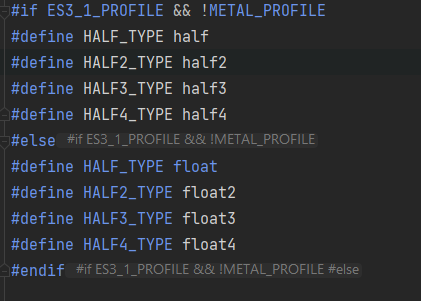
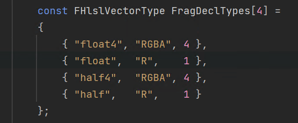

在某日调试安卓的过程中发现了一点ue精度上的小问题，关于地形，在某snapdragon机器上跑出大规模的花屏（Nanite的三角形的错觉hh)，最后排查到是精度问题导致的，发现UE5相比ue4提供了更加精细的精度控制，只用于usf和ush文件。

<!-- more -->
这篇文章可以作为一个精度问题的参考[UE中的浮点数精度问题](https://zhuanlan.zhihu.com/p/440619745)，感谢博主，里面也提到一些对精度要求高的场景比如地形uv计算，水材质，天空材质这种大尺寸材质的计算中最好使用全精度去做。half最大也就65504，很容易精度爆掉。
去看了ue5的代码发现，force float主要在两个地方生效，一个是在Platform.ush中，这里控制的主要是所有平台编译后的shader中的精度，如果这里force float也就是上面的Use Full-precision for every float，会使得包括所有引擎在内的shader，material生成shader都使用全精度。注释里提到es/metal强制为half使用float，平台没有做低精度的优化，而vk和es31会为half值使用相对精度。放截图

而对于Use Full-precision for MaterialExpressions only，则是在common.ush中的define里转换

这里的转换对从Material编译生成的shader起效， Vertex shader中因为uv和位置计算则全程使用float。

最后对于metal确实在MetalShaderCompiler中有这样一句强制指定，怪不得没问题，所以现在setting中的Force 32bit Floating Point Precision其实是默认启用的，关闭后也没啥用
```C++
AdditionalDefines.SetDefine(TEXT("FORCE_FLOATS"), (uint32)1);
```
在关于移动平台的开发中，精度坑是永远躲不掉，硬件坑很多而且一直在变化中，需要经常关注。

--- 

更新在ue5.1 release中，加入了对移动平台的单独设置，粒度更小一些，推荐设置一下。


---
更新一下UE5.1最新的修改

Epic在UE5.1版本中更新了对iOS/Metal平台的半精度支持，稍微看看它的实现，[commit在这](https://github.com/EpicGames/UnrealEngine/commit/4e14e3f3864a994379da51567791966597629589#diff-5963bff9ef52bec27f0a28bf16791d7b93d16018199341055438477f1fe14b17)

这是一个稍微有些规模的改动，但很有用

首先去掉了之前强制写死ForceFloats的一堆define

在编译端做了一些工作

MetalDerivedData.cpp中的这个函数Patch16bitInHlslSource很有意思，在UE5中统一将shader编译器换成了DXC，而DXC是不支持half精度的Texture和Buffer，会引发layout错误，统一将hlsl中的half换成了float。请注意这个编译器限制。

同时修改中还处理了很多不能用half的情况，比如Spirv中对fastNormalize的参数就不能使用half。

但是在platform的修改只有下面这一处，也就是很有限的地方替换float，Epic并没有大规模支持，这个修改机制还在测试，在BaseEngine.ini还是将IOSRuntimeSettings默认ForceFloats = true。如果想尝试可以自己在float的地方改成下面比如HALF_TYPE的def。虽然暂时没有在PS中的转译大规模启用，但是它用在了另外一个重要的地方。

可以看到修改在MetalDerivedData.cpp中，PatchSpecialTextureInHlslSource函数中添加了half的支持，可以看出这个函数只处理gl_LastFragData，也就是和FrameBuffer的格式有关系，读写的带宽可以减少一半，对移动端简直是天使的馈赠。遗憾的是，可以观察到，只有PostProcess的部分Pass有所应用，需要更进一步的测试。但是前面DXC的限制不是一个好消息，希望可以在Texture和Buffer也可以尽快应用吧，进一步减少读写带宽。虽然特性有点瘸腿，但是方向总是好的，读者如果有兴趣也可以魔改一下看看是不是有所收益。

