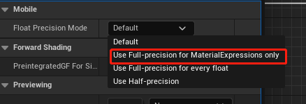
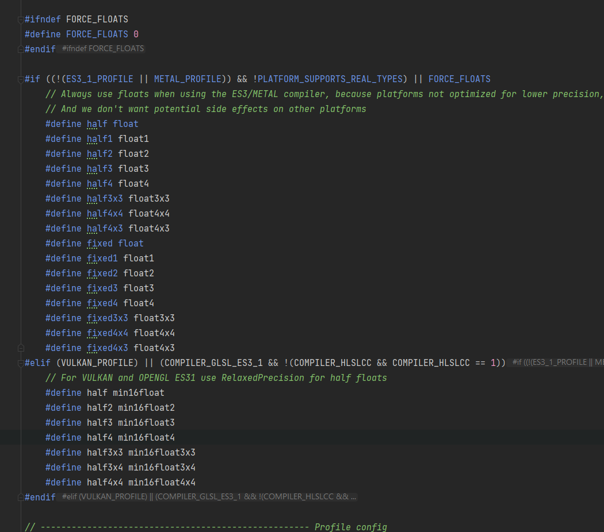
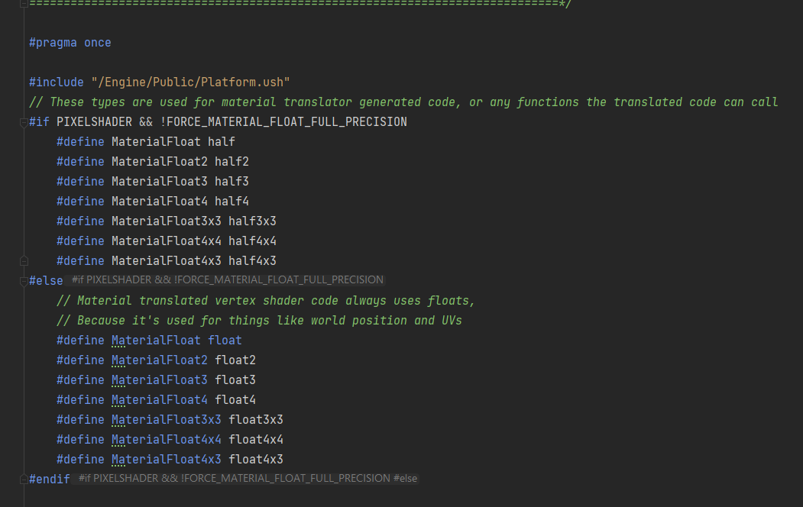

在某日调试安卓的过程中发现了一点ue精度上的小问题，关于地形，在某snapdragon机器上跑出大规模的花屏（Nanite的三角形的错觉hh)，最后排查到是精度问题导致的，发现UE5相比ue4提供了更加精细的精度控制，只用于usf和ush文件。

<!-- more -->
这篇文章可以作为一个精度问题的参考[UE中的浮点数精度问题](https://zhuanlan.zhihu.com/p/440619745)，感谢博主，里面也提到一些对精度要求高的场景比如地形uv计算，水材质，天空材质这种大尺寸材质的计算中最好使用全精度去做。half最大也就65504，很容易精度爆掉。
去看了ue5的代码发现，force float主要在两个地方生效，一个是在Platform.ush中，这里控制的主要是所有平台编译后的shader中的精度，如果这里force float也就是上面的Use Full-precision for every float，会使得包括所有引擎在内的shader，material生成shader都使用全精度。注释里提到es/metal强制为half使用float，平台没有做低精度的优化，而vk和es31会为half值使用相对精度。放截图

而对于Use Full-precision for MaterialExpressions only，则是在common.ush中的define里转换

这里的转换对从Material编译生成的shader起效， Vertex shader中因为uv和位置计算则全程使用float。

最后对于metal确实在MetalShaderCompiler中有这样一句强制指定，怪不得没问题，所以现在setting中的Force 32bit Floating Point Precision其实是默认启用的，关闭后也没啥用
```C++
AdditionalDefines.SetDefine(TEXT("FORCE_FLOATS"), (uint32)1);
```
在关于移动平台的开发中，精度坑是永远躲不掉，硬件坑很多而且一直在变化中，需要经常关注。

--- 

更新在ue5.1 release中，加入了对移动平台的单独设置，粒度更小一些，推荐设置一下。
